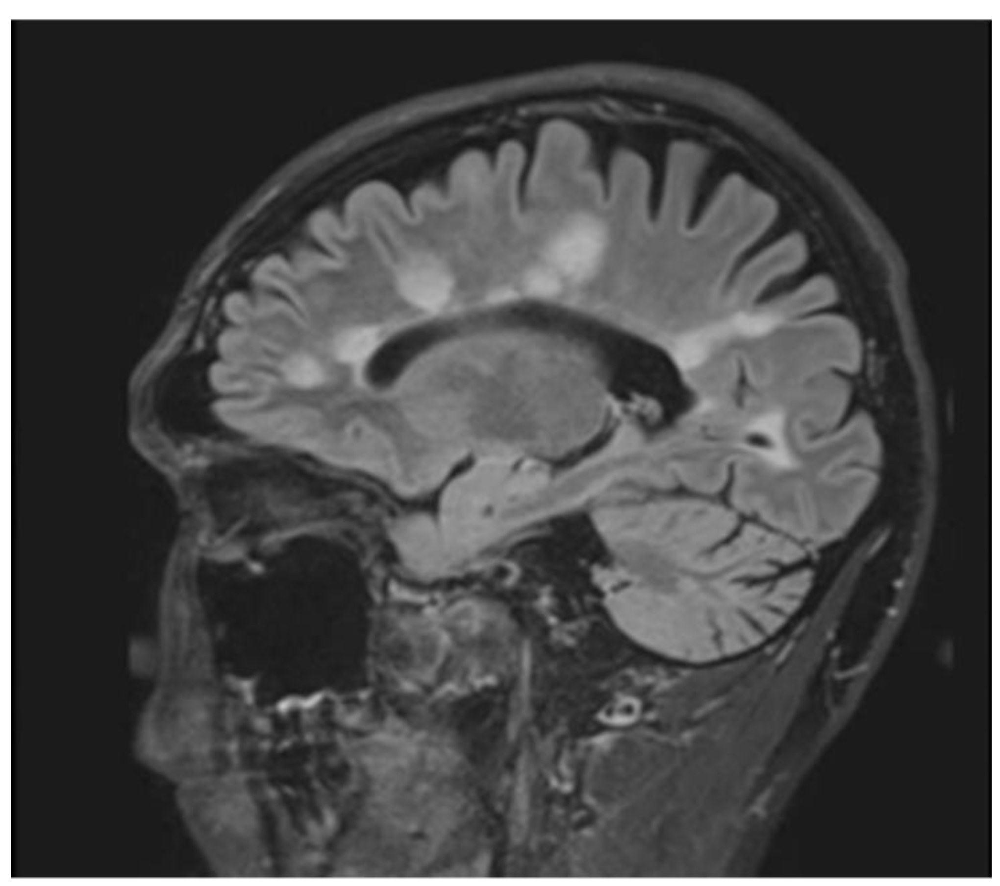
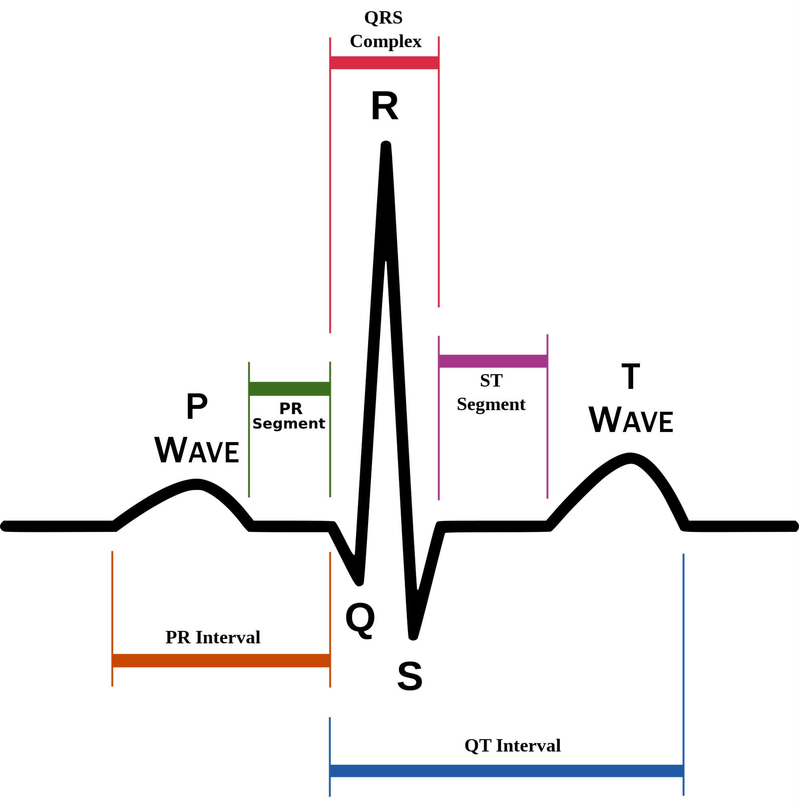

# Advanced Machine Learning
This repo contains the projects for the course Advanced Machine Learning at ETH Zurich. The projects resemble Kaggle data science competitions. We were given training data and were asked to make predictions on out of sample data. Our models were evaluated both on a public leaderboard and on a private leaderboard.

## Project 0: Dummy task
Project 0 is a dummy task to help student familiarize with the course framework. We were asked to read the features and to regress the mean.

## Project 1: Predict the age of a person from their MRI scan

This project is a regression task where we were asked to predict a patient age from some MRI features. The original MRI features were perturbed in several ways. We needed to perform outliers detection, feature selection, and other preprocessing to achieve the best result.

The task1 was to predict a person’s age from the brain image data: a standard regression problem. The original dataset included 832 features as well as a lot of NaN values and a few outliers. A good preprocessing stage was necessary in order to have a well defined dataset that could be used in our regression model. The first step is the imputation of the dataset. At first a simple median imputation was performed. Then we decided to opt for a K-Nearest-Neighbour imputation that achieved better validation results.
As a next step, we proceeded with the feature selection process. Several algorithms were tried. At first, we eliminated the most correlated features, then we selected the most relevant features according to the Pearson Coefficient. This method ouperformed Lasso regression as a feature selection step.
A lot of outlier detection techniques were used but we decided to keep the outliers as the reduction of data almost always proved to be detrimental.
Our final predictor was an ensemble of: Multi-Layer-Perceptron, XGBoost, SupportVectorRegression,RandomForest. The R2 score of the model was 0.76 on the public leaderboard and 0.71 on the private one.

## Project 2: Heartbeat multi-class classification on ECG signals

This is a classification task where we were asked to map each ECG signal to one of 4 possible classes: Normal (0), AFib (1), Other Rhythm (2), and Noisy Recording (3).

One of the main challenges was to deal with class imbalance: in order to fix the unbalanced classes different techniques were used including upsampling of the classes with lower number of samples and downsampling of the class with higher number of samples. All of these techniques were outperformed though by using different weights for the penalty term during the training of our classification model. However, the best results were achieved by performing learning in "cascade" fashion: first we distinguish between class 0 and class "not 0". Among the "class not 0 samples", we distinguish between class 1 and class "not 1". Among the "class not 1 samples", we classify between class 2 and 3. 

Our classification algorithm is the ensemble of two approaches.

Approach 1): The most interesting part of the project is the feature extraction from the raw ECG signals data.The signals were cleaned with a low-pass filter to remove 50 and 60 Hz noise of the line. BioSSPy library was used to extract meaningful information from the signal. The features were constructed by considering the R Peaks, QRS complex, PR interval, QT interval, ST segment, cardiac frequency, Wavelet transform coefficients. Statistically meaningful metrics (median,mean,variance,min,max) were used to build up a set of 25 features to train our classifiers. An ensemble of GradientBoost, RandomForest, SVM, Multi-Layer-Perceptron was trained on these features.

Approach 2): After having padded the signals with zeros to make them of uniform length, we fed the entire signals into a convolutional neural network with a classification head. The locality of the convolution performs an automatic feature extraction that captures well the local relationships in the time-series.

The final predictions were obtained after soft-voting with the predictions of these two approaches. The accuracy was 0.86 on the public leaderboard and 0.84 on the private one.

